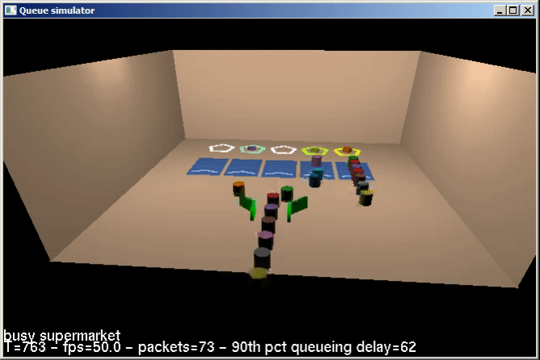

## Queue simulator animation

This repository includes 3 animations for simple queue systems. It supports the following queueing scenarios:

* 1 queue with 1 processor (bank model)
* 1 queue with multiple processors
* multiple queues with multiple processors (supermarket model)
* multiple queues with multiple processors with work stealing

To switch between the different queueing models press the UP and DOWN arrows while running the visualizations.

It can visualize the queues in 3 different ways:

* Terminal based with ncurses.
* 2D graphics with matplotlib.
* 3D graphics with OpenGL.

### Screenshots

